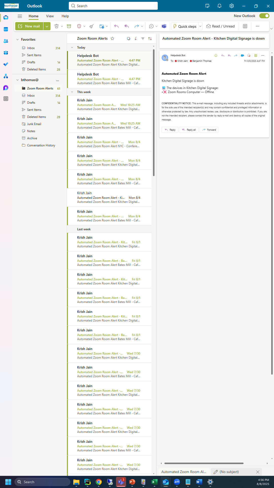

<div align="center">
<h1 id = "title"> Zoom Room Status Project</h1>
<h5 id= "authors"> Authors: Ben Thomas & Krish Jain</h5>
</div>


<div align="center">
  <h2 id="table-of-contents">📖 Table of Contents</h2>
  <hr/>
  <p>
    📌 <a href="#project-overview">Project Overview</a><br>
    🏗️ <a href="#architecture--tech-stack">Architecture &amp; Tech Stack</a><br>
    ⚙️ <a href="#setup--installation-structure">Setup &amp; Installation Structure</a><br>
    🎥 <a href="#usage--demo">Usage &amp; Demo</a><br>
    🚀 <a href="#next-steps--lessons-learned">Next Steps &amp; Lessons Learned</a>
  </p>
</div>


<!--

Project Overview: Elevator pitch—what it is and why it matters.
Architecture & Tech Stack: How it’s built and what tools you used.
Setup & Installation: Exactly how to get it running.
Usage & Demo: Show it in action—commands, screenshots, or GIFs.
Next Steps & Lessons Learned: Reflect on what you’d do next and what you learned along the way.
-->

<div align="center">
  <h2 id="project-overview">📌 Project Overview</h2>
  <hr />
</div>

The days of random Zoom Room issues—where, out of nowhere, you have to stop what you’re working on to address an offline room—are over. No more surprises when you come into the office after the weekend only to find that a room has been offline the whole time and needs to be used within the hour.

  

With this Zoom Room script running on **NEBAV02**, the status of all NEB Zoom Rooms across all our locations is continuously monitored. If a Zoom Room (or any of its devices) goes offline, the IT team will be instantly alerted via Microsoft Teams. The script will also automatically generate a support ticket on TrackIt, giving us another way to track outages while ensuring you get credit for the work you do 🙂.

  

To integrate seamlessly with Rapid7 and other monitoring tools, we developed a lightweight tracking system that appends each new event—such as a room going offline/coming back online, a device going offline/coming back online, the script going offline, message-sending errors, and more—into a JSON Lines file.
<div align="center">
  <h2 id="architecture--tech-stack">🏗️ Architecture & Tech Stack</h2>
  <hr />
</div>
--

At the heart of the script is Python. About 90% of the backend is written in Python, handling everything from OAuth verification to formatting Microsoft Teams messages, monitoring which rooms go offline or come back online, and more. The remaining 10% runs on Power Automate, giving us a secure way to send Teams notifications without relying on a webhook or other communication method. This is also where we create the HelpDesk ticket that gets posted to TrackIt.

It's important to note that we do recognize another viable way of communication could be done through Microsoft GraphAPI. We decided to go a different route due to restrictions.
<div align="center">
  <h2 id="setup--installation-structure">⚙️ Setup & Installation Structure</h2>
  <hr />
</div>

### Prerequisites: 
- You must have Python 3.9+
- In order to properly run this program, ensure that you have all necessary environmental variables set on your local machine:
```
MSPOWERAUTOMATE_LINK
ZOOM_CLIENT_ID
ZOOM_CLIENT_SECRET
ZOOM_ACCOUNT_ID
```

- The following is the command to download the necessary packages.

```bash
pip install requests pystray Pillow
```
- Must have a Zoom Room Admin account to set up a Zoom Room API
- Enable the following API Scopes on the Zoom Room Admin portal:
 ```
zoom_rooms:read:list_rooms:admin

zoom_rooms:read:room:admin

zoom_rooms:read:list_devices:admin
```
<div align="center">
  <h2 id="usage--demo">🎥 Usage & Demo</h2>
</div>

<hr />

<div style="display: flex; justify-content: center; gap: 20px; flex-wrap: wrap;">
    <a href="newexample.mp4" style="flex: 1 1 300px; max-width: 400px;">
        
    </a>
    <a href="outlook.png" style="flex: 1 1 300px; max-width: 400px;">
        
    </a>
</div>


<div align="center">
  <h2 id="next-steps--lessons-learned">🚀 Next Steps & Lessons Learned</h2>
  <hr />
</div>
As we move to Microsoft Intune, we will gain more intricate control over our iPad and Zoom Room devices. Using the API and the data it provides, we plan to add features like battery percentage, if a devices was left off the charger while not in use, software updates, and more.

We really had a lot of fun building this app and learned so much with the ability to do API development at an enterprise level. Our hope is to showcase the true power that API's hold and what this could mean, not just for our team, but for the entire bank. We can build dedicated tools that meet the direct needs of each and every team in the bank. 